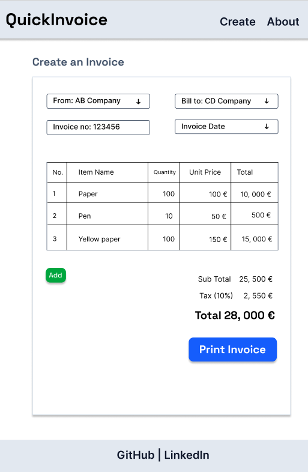

# Quick Invoice

## Overview
A simple invoice management app built with Vue 3, Nuxt 3, TypeScript and Tailwind CSS.
Designed for simplicity and easy extensibility.



## Features
- Generate invoices with customizable fields
- Export invoices as PDF
- Responsive design for desktop and mobile
- Simple UI, built with reusable components
- Planned support for authentication and invoice history
- Future enhancements like A/B testing, multi-language, and CSV export

## Tech Stack
- **Vue.js 3**
- **Nuxt 3**
- **TypeScript**
- **Tailwind CSS**
- **Figma** - [Design file](https://www.figma.com/design/buevG8pmnyx6B4U3FwyRVw/QuickInvoice?node-id=0-1&t=7mFtCDF4piA5mxrS-1)
- **GitHub** - [Repository](https://github.com/kizuyoko/quick-invoice)
- **Pinia**- State management
- **Jest, Cypress** - Testing
- **Strapi** - Headless CMS
- **Storybook** - UI Component Library
- **Statsig** - A/B testing
- **Vercel** - [Deployment](https://quick-invoice-eight.vercel.app/)
- **Lighthouse**

## Project Roadmap

### Phase 1: MVP (Git: feature/mvp)
- [x] Planning
- [x] Layout in Figma
- [x] Basic Nuxt 3 setup with Tailwind CSS
- [x] GitHub Setup
- [x] Favicon, font family, CSS base
- [x] Basic components, UI
- [x] Three pages: Home, Create, About
- [x] Meta
- [ ] Minimal layout and styling
- [ ] Responsive design
- [ ] Simple invoice form with PDF export
- [ ] README with usage instructions


### Phase 2: Enhancements (Git: feature/enhancements)
- [ ] Strapi integration
- [ ] Storybook setup for UI components
- [ ] Currency API integration
- [ ] Testing setup (Jest, Cypress)
- [ ] Improved PDF layout improvements (logo, itemized list, totals)
- [ ] Input validation
- [ ] Reusable invoice templates
- [ ] SEO optimization (meta tags, OG images)
- [ ] Performance audit and improvements
- [ ] Accessibility fixes (ARIA, contrast, keyboard navigation)

### Phase 3: Advanced Features (Git: feature/advanced)
- [ ] Authentication (login / register)
- [ ] Invoice history & overview
- [ ] Edit and manage saved invoices
- [ ] Multi-language support (i18n)
- [ ] Dark mode toggle
- [ ] Export to CSV
- [ ] A/B Test with Statsig

# Nuxt Minimal Starter

Look at the [Nuxt documentation](https://nuxt.com/docs/getting-started/introduction) to learn more.

## Setup

Make sure to install dependencies:

```bash
# npm
npm install

# pnpm
pnpm install

# yarn
yarn install

# bun
bun install
```

## Development Server

Start the development server on `http://localhost:3000`:

```bash
# npm
npm run dev

# pnpm
pnpm dev

# yarn
yarn dev

# bun
bun run dev
```

## Production

Build the application for production:

```bash
# npm
npm run build

# pnpm
pnpm build

# yarn
yarn build

# bun
bun run build
```

Locally preview production build:

```bash
# npm
npm run preview

# pnpm
pnpm preview

# yarn
yarn preview

# bun
bun run preview
```

Check out the [deployment documentation](https://nuxt.com/docs/getting-started/deployment) for more information.
