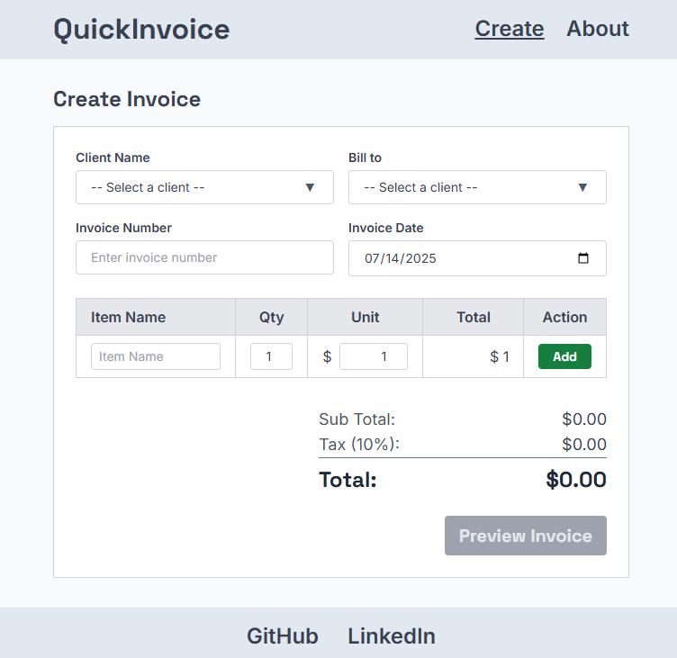

# Quick Invoice

## Overview
A simple invoice management app built with Vue 3, Nuxt 3, TypeScript and Tailwind CSS.
Designed for simplicity and easy extensibility.



## Features
- Dynamic form with validation
- Generate invoices with customizable fields
- Export invoices as PDF
- Responsive design for both desktop and mobile
- Simple and clean UI, built with reusable components
- Planned features: authentication and invoice history
- Future enhancements: A/B testing, multi-language support, CSV export

## Tech Stack
- **Vue.js 3**
- **Nuxt 3**
- **TypeScript**
- **Tailwind CSS**
- **Figma**: [Design file](https://www.figma.com/design/buevG8pmnyx6B4U3FwyRVw/QuickInvoice?node-id=0-1&t=7mFtCDF4piA5mxrS-1)
- **GitHub**: [Repository](https://github.com/kizuyoko/quick-invoice)
- **Pinia**: State management
- **Jest, Cypress**: Testing
- **Strapi**: Headless CMS
- **Storybook**: UI Component Library
- **Statsig**: A/B testing
- **Vercel**: [Deployment](https://quick-invoice-eight.vercel.app/)
- **Lighthouse**: Performance auditing, [result](https://pagespeed.web.dev/analysis/https-quick-invoice-eight-vercel-app/0xz8evfe3d?form_factor=desktop)

## Project Roadmap

### Phase 1: MVP (Git: feature/mvp)
This MVP provided valuable learning opportunities, including:
- Shifting from a React-centric mindset to Vue/Nuxt practices
- Understanding form handling and validation in Vue
- Implementing PDF generation on the frontend

#### Checklist 
- [x] Planning
- [x] Layout in Figma
- [x] Basic Nuxt 3 setup with Tailwind CSS
- [x] GitHub Setup
- [x] Favicon, font family, CSS base
- [x] Basic components, UI
- [x] Three pages: Home, Create, About
- [x] Meta
- [x] Minimal layout and styling
- [x] Invoice form, base
- [x] Responsive design
- [x] Form Refactor
- [x] Define TypeScript types (Invoice, InvoiceItem, Client, etc)
- [x] Use local data for clients for MVP purposes.
- [x] 404
- [x] Input row to table
- [x] Delete button
- [x] Start Pinia for state management.
- [x] Auto-calculate totals
- [x] Print Invoice button to connect with items, client, billto, number, and date
- [x] Invoice preview
- [x] Print Invoice as PDF
- [x] Modal PDF preview
- [x] Invoice PDF style
- [x] Validator

### Phase 2: Enhancements (Git: feature/enhancements)
This phase focuses on refining the user experience, improving accessibility and performance, and laying the groundwork for future scalability.  
Key goals include polishing UI components, expanding integrations, and adding robust testing and SEO support.

- [ ] Enable item editing
- [ ] Strapi integration
- [ ] Storybook setup for UI components
- [ ] Currency API integration
- [ ] Testing setup (Jest, Cypress)
- [ ] Improved PDF layout improvements (logo, itemized list, totals)
- [ ] Input validation
- [ ] Reusable invoice templates
- [ ] SEO optimization (meta tags, OG images)
- [ ] Performance audit and improvements
- [ ] Accessibility fixes (ARIA, contrast, keyboard navigation)

### Phase 3: Advanced Features (Git: feature/advanced)
- [ ] Authentication (login / register)
- [ ] Invoice history & overview
- [ ] Edit and manage saved invoices
- [ ] Multi-language support (i18n)
- [ ] Dark mode toggle
- [ ] Export to CSV
- [ ] A/B Test with Statsig

# Nuxt Minimal Starter

Look at the [Nuxt documentation](https://nuxt.com/docs/getting-started/introduction) to learn more.

## Setup

Make sure to install dependencies:

```bash
# npm
npm install

# pnpm
pnpm install

# yarn
yarn install

# bun
bun install
```

## Development Server

Start the development server on `http://localhost:3000`:

```bash
# npm
npm run dev

# pnpm
pnpm dev

# yarn
yarn dev

# bun
bun run dev
```

## Production

Build the application for production:

```bash
# npm
npm run build

# pnpm
pnpm build

# yarn
yarn build

# bun
bun run build
```

Locally preview production build:

```bash
# npm
npm run preview

# pnpm
pnpm preview

# yarn
yarn preview

# bun
bun run preview
```

Check out the [deployment documentation](https://nuxt.com/docs/getting-started/deployment) for more information.
